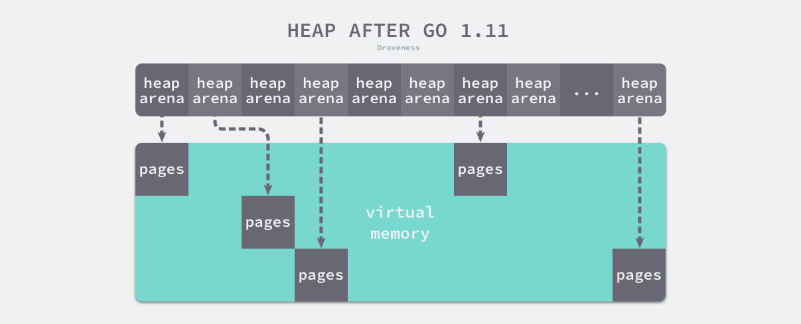

# Go的内存管理：

## why？
对于大多数使用 Golang 的开发者来说，并不需要深入理解内存管理的底层细节。内存分配和垃圾回收这些复杂的操作，已经被编译器（Compiler）和运行时（Runtime）进行了高度优化和封装，使开发者可以专注于业务逻辑，而无需手动管理内存。

Go语言的内存模型旨在提供简单性和高效性，它会自动处理栈与堆的分配，通过逃逸分析（Escape Analysis）来优化变量的存储位置，并不断改进垃圾回收（GC）机制，以在性能和资源使用之间取得平衡。

但是，在高并发系统、实时应用、内存密集型任务等对性能要求较高的应用场景下，深入了解Go的内存管理机制仍然有助于程序性能的优化以及资源的高效使用。
尽管如今ChatGPT、DeepSeek等LLM应用极大的提升了语言文本理解的精度以及信息检索的效率，但是我仍然认为，工程师只有深入了解甚至熟悉底层细节，才能更精确地提出问题，并获得更准确的答案，从而真正提升使用效率，而非盲目依赖模型，讲问题随意抛给AI，而不加以思考。

此外，无论是JAVA的JVM还是Golang的Runtime，他们的底层设计考虑到诸多关键因素，其中许多通用的数据结构设计理念对开发者而言，都是极具价值的技术积累。深入理解这些底层机制，不仅有助于提升代码质量和工程能力，还能在未来面对复杂需求时，在面对某些复杂需求时，凭借深厚的知识储备，灵光一现，找到更优雅、高效的解决方案。

## 线性内存模型
言归正传，当Go应用程序启动时，它会向操作系统申请内存，并初始化为虚拟内存空间。在Go的不同版本中，内存空间的管理方式也经历了如下演变:
- **Go 1.10 以前**：采用线性内存模型
- **Go 1.10 及以后**：引入稀疏内存模型，提高了大规模应用的内存管理效率
为了更好地理解Go的内存管理机制，我们先从较为基本的线性模型入手，熟悉Go内存分配中的基本概念，然后再深入探讨更完整的内存管理体系。


<p style="font-size: 14px; color: lightgrey; text-align: center">
    图 1: 线性内存模型示意图
</p>

如图所示，Go 1.10之前，Go运行时采用线性地址空间来管理堆内存，主要由一下三部分组成
- **`arena`**:`arena`是真正存储对象的区域，Go的Runtime按照8KB大小对该区域进行分页，再根据对象大小不同，将一个或连续多个内存页组成`mspan`(Golang的内存管理单元)进行管理。
- **`spans`**: `spans`存储了内存管理单元`mspan`的指针，用于索引到对应的内存页
- **`bitmap`**: `bitmap`用于标识`arena`区域哪些地址保存了对象。一个byte可以标识`arena`区域内4个指针大小(8 bytes)的内存。如下图所示，一个byte会用两个bits来表示`arena`中8byte大小的内存状态

<p style="font-size: 14px; color: lightgrey; text-align: center;">
    图 2: bitmap示意图
</p>
从上述的内存示意图可以看出，这三个区域的大小是固定的。
`arena`做为存储对象的实际区域，空间大小为512GB。
`spans`存储`mspan`的指针，用于索引到`arena`区域内对应的page，则该区域的大小为`512GB / 8KB * 8B = 512MB`。
同理，我们可以计算出`bitmap`区域所需要的内存大小`512GB / (8B * 4) = 16GB`。

### 内存管理单元mspan
<div style="text-align: center;">
    
    <p style="font-size: 14px; color: lightgrey">图 3: mspan示意图</p>
</div>

`mspan`是Golang进行内存管理的基本单位，是由1个page或者多个连续page组成的内存区域。
`mspan`根据负责管理的对象大小分为67个class，每个class内负责存储的对象大小都不一样，换言之，每当程序申请内存时，Go运行时会根据所需要的内存大小到对应大小范围的`mspan`进行内存分配。

再深入`mspan`具体的细节之前，有个问题很重要，即为什么需要在内存页上又增设一层`mspan`的概念呢？换言之，为什么不直接在page上直接进行内存分配呢？

答案是效率，即分配对象的效率。假设现在以page做为内存管理对象而非不同大小的`mspan`，运行时会怎么操作？
从bitmap或者linkedlist上进行遍历查找直到有满足所需大小的内存空间，近似一个滑动窗口的问题，效率很低。
因此，通过设计层面划分67个不同对象大小的class，先根据所需内存寻找`mspan`，随后配合`spans`索引到对应的page寻找空闲内存，效率会高很多。

```go
// path: /usr/local/go/src/runtime/mheap.go
type mspan struct {
	next *mspan //链表前向指针，用于将span链接起来
	
	prev *mspan //链表前向指针，用于将span链接起来
	
	startAddr uintptr // 起始地址，也即所管理页的地址
	
	npages uintptr // 管理的页数
	
	nelems uintptr // 该mspan总计对象个数
	
	allocBits *gcBits  //分配位图，每一位代表对应对象是否已分配
	
	allocCount uint16 // 该mspan内已分配块的对象数目
	
	spanclass spanClass  // class表中的class ID，和Size Class相关
	
	elemsize uintptr //该mspan内单位对象大小
}
```


<p style="font-size: 14px; color: lightgrey; text-align: center;">
    图 4: mspan整体示意图
</p>

整体来说，中小对象的分配占整个程序对象分配的大头，某些大小的`mspan`可能会有多个，相同大小的mspan通过链表连接在一起方便进行可分配对象的查找。
Runtime并不需要根据其实地址和单位对象大小进行线性查找，可以根据每一个mspan上的信息快速判断该mspan是否有空间进行对象分配，如果没有，跳到下一步`mspan`。

从上图，我们可以更明显的看出，`mspan`在内存管理上的作用，按照对象的大小分成不同规格的管理对象，记录负责内存页上对象的分配情况，关联其他相同class的`mspan`进行可分配对象的快速查询。

### 内存管理
在了解清楚Golang的内存管理单元`mspan`之后，我们将关注点拉回到内存管理和内存分配上。当一个goroutine申请内存时，需要从`arena`区域申请`mspan`，随着goroutine的数目的增加，针对`arena`的锁冲突会导致性能的劣化。
所以，如何减少锁冲突从而提升Go程序分配对象的性能成为内存管理的一个核心问题。遇到这种问题，最常用的解决方案是将大部分的对象分配本地化，从而减少因分配对象带来的锁竞争。这一版内存分配采用的是`mcache`和`mcentral`对内存进行管理。

#### mcache
每一个工作线程P均包含一个私有的`mcache`，每一个`mcache`包含所有span class的`mspan`链表供工作线程P进行对象分配。
```go
//path: /usr/local/go/src/runtime/mcache.go
type mcache struct {
    alloc [numSpanClasses]*mspan
}

numSpanClasses = _NumSizeClasses << 1
```

为什么`mspan`的class数目是size class的两倍？- `mspan`分为指针对象和非指针对象，主要加速内存回收速度，暂时先不深究细节，此处我们仍以`mspan`作为基本单元了解内存分配。

随着程序不断运行，工作线程P不断向`mcentral`申请`mspan`，并缓存到本地`mcache`用于内存分配。
而`mcache`是和工作线程P绑定的，同一时间一个P上只有一个goroutine执行，所以不存在锁竞争的问题。
#### mcentral
当本地的`mcache`某个span class没有可用空间时，工作线程要从哪里获取内存或者`mspan`呢？ 

此时Runtime会向`mcentral`申请对应class的`mspan`, `mcentral`已按照span class对内存进行划分，并全局管理不同class的`mspan`，用于`mcache`申请获取。一个span class对应一个`mcentral`对象，以供`mheap`进行统一管理。
```go
//path: /usr/local/go/src/runtime/mcentral.go

type mcentral struct {
    lock mutex // 互斥锁，避免多个goroutine的竞态问题
	
    sizeclass int32 
	
    nonempty mSpanList // 尚有空闲object的mspan链表
    
    
    empty mSpanList // 没有空闲object的mspan链表，或者是已被mcache取走的msapn链表
	
    nmalloc uint64  // 已累计分配的对象个数
}
```

<p style="font-size: 14px; color: lightgrey; text-align: center;">
    图 5: mcentral示意图
</p>

#### mheap
`mheap`全局唯一，是针对之前提及的`spans`,`arena`以及`bitmap`组成的内存空间进行管理，同时维护所有span class的`mcentral`对象。
如果内存分配过程中，`mcentral`对应class无可用`mspan`, `mheap`会从`arena`区域分配指定数目的page，产生新的`mspan`供`mcentral`使用。
如果`mheap`没有可用的内存空间，则Runtime会向操作系统申请。
```go
//path: /usr/local/go/src/runtime/mheap.go
type mheap struct {
	lock mutex
	
	// spans: 指向mspans区域，用于映射mspan和page的关系
	spans []*mspan 
	
	// 指向bitmap首地址，bitmap是从高地址向低地址增长的
	bitmap uintptr 
	
	arena_start uintptr  // 指示arena区首地址
	
	// 指示arena区已使用地址位置
	arena_used  uintptr 
	
	// 指示arena区末地址
	arena_end   uintptr 

	central [67*2]struct {
		mcentral mcentral
		pad [sys.CacheLineSize - unsafe.Sizeof(mcentral{})%sys.CacheLineSize]byte
	}
}
```

<p style="font-size: 14px; color: lightgrey; text-align: center;">
    图 6: mheap示意图
</p>

### 高效
Go基于内存是连续的假设，结合TCMalloc(Thread-Caching Malloc, 线程缓存分配)以及分级缓存的管理模式，实现了较为高效的内存分配。
跟其他编程语言相比，Go的内存分配高效在哪。大体上编程语言的内存分配器一般为两种方式，一种是线性分配器，一种是空闲链表分配。
#### 线性分配

<p style="font-size: 14px; color: lightgrey; text-align: center;">
    图 7: 线性分配器示意图
</p>

线性分配主要通过指针记录线性内存空间中`已使用`和`未使用`空间的边界，用户程序向分配器申请内存，分配器只需要检查剩余的空间内存、返回分配的内存区域并修改指针位置即可。
该方式可实现较快的执行速度和较低的实现复杂度，但是内存的复用性较差。

<p style="font-size: 14px; color: lightgrey; text-align: center;">
    图 8: 线性分配器内存碎片
</p>

内存回收之后，在使用区域的空闲内存无法及时被复用，考虑到这样的问题，线性分配器通常会与具有拷贝特性的垃圾回收算法配合，通过定期拷贝已使用内存、移动指针，提升内存分配器的效率。
但是对于直接暴露指针的编程语言，该策略并不能实现。
#### 链表分配器

<p style="font-size: 14px; color: lightgrey; text-align: center;">
    图 9: 链表分配器示意图
</p>

链表分配器（Free-List Allocator）可以重用已经被释放的内存，它在内部会维护一个类似链表的数据结构。当用户程序申请内存时，空闲链表分配器会依次遍历空闲的内存块，找到足够大的内存，然后申请新的资源并修改链表。
因为不同的内存块通过指针构成了链表，所以使用这种方式的分配器可以重新利用回收的资源，但是因为分配内存时需要遍历链表，所以它的时间复杂度是O(n)。

## 稀疏内存
接下来，我们再画一小部分篇幅延伸下Go内存管理的一次重要变化: 有限的线性内存->无上限的稀疏内存。
最早，在Go的1.5版本时，有一位开发者反馈，当他在处理大数据相关的任务时，当时硬编码的128G的内存大小成为了限制。尽管后面Go官方将内存大小升级到了512GB，但是仍然有开发者反馈内存不够用。
最后在Go 1.10版本，Go官方亲自下场承诺会在新版本好好考虑这个问题合适的解决方案。

<p style="font-size: 14px; color: lightgrey; text-align: center;">
    图 10: 稀疏内存示意图
</p>
如上图所示，运行时使用二维数组`heapArena`进行内存管理，每个单元管理64MB内存空间

```go
type heapArena struct {
	bitmap       [heapArenaBitmapBytes]byte
	spans        [pagesPerArena]*mspan
	pageInUse    [pagesPerArena / 8]uint8
	pageMarks    [pagesPerArena / 8]uint8
	pageSpecials [pagesPerArena / 8]uint8
	checkmarks   *checkmarksMap
	zeroedBase   uintptr
}
```
该结构体中的 bitmap 和 spans 与线性内存中的 bitmap 和 spans 区域一一对应，zeroedBase 字段指向了该结构体管理的内存的基地址。上述设计将原有的连续大内存切分成稀疏的小内存，而用于管理这些内存的元信息也被切成了小块。

不同平台和架构的二维数组大小可能完全不同，如果我们的 Go 语言服务在 Linux 的 x86-64 架构上运行，二维数组的一维大小会是 1，而二维大小是 4,194,304，因为每一个指针占用 8 字节的内存空间，所以元信息的总大小为 32MB。由于每个 runtime.heapArena 都会管理 64MB 的内存，整个堆区最多可以管理 256TB 的内存，这比之前的 512GB 多好几个数量级。