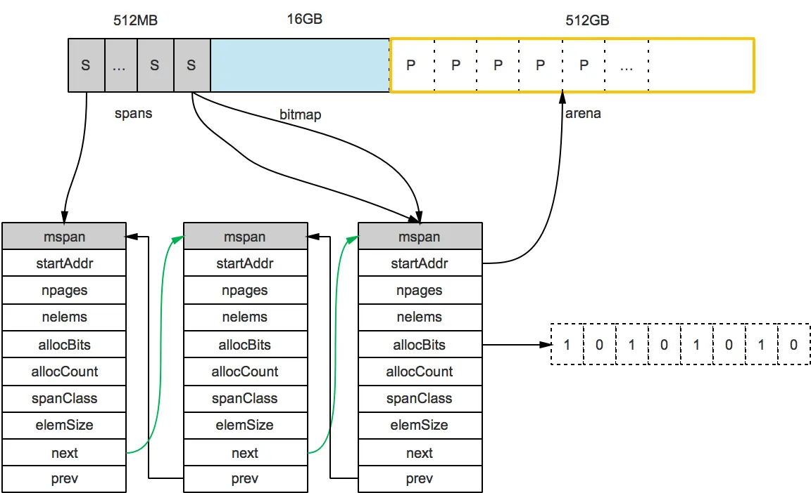
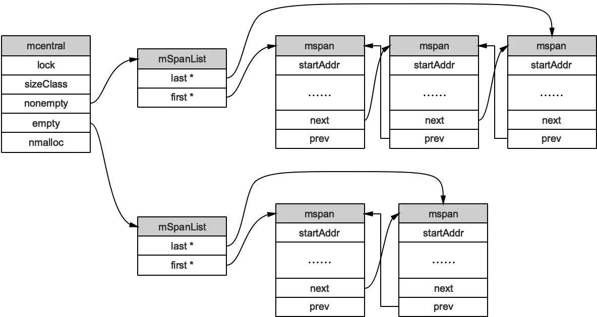
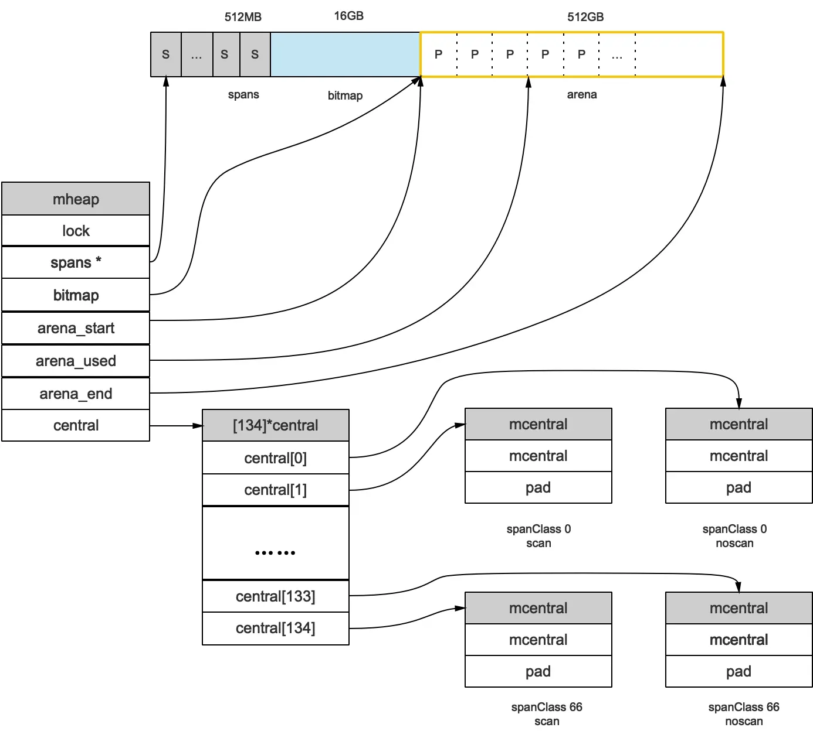

# Go的内存管理：

当Go的应用程序启动时，程序会向操作系统申请内存并初始化为虚拟内存空间。
内存空间目前分为线性空间(Go 1.10以前)和稀疏空间(Go 1.10以后)。
我们先从较为简单的线性模型入手，熟悉Golang内存分配中的基本概念，以及在内存管理中一些通用设计理念。

## 线性内存模型

<p style="font-size: 14px; color: lightgrey; text-align: center">
    图 1: 线性内存模型示意图
</p>

如图所示，线性的虚拟内存空间分为三个部分`spans`, `bitmap`, `arena`，由这三个部分组成的内存空间是Golang的堆。
- **`arena`**:`arena`是真正存储对象的区域，Golang的Runtime将该区域按照8KB大小进行分页，之后根据存储的对象大小不同，将内存页组成`mspan`(Golang的内存管理单元)进行组合。
- **`spans`**: `spans`存储了内存管理单元`mspan`的指针，用于索引到对应的内存
- **`bitmap`**: `bitmap`用于标识`arena`区域哪些地址保存了对象。一个byte可以标识`arena`区域内4个指针大小(8 bytes)的内存。如下图所示，一个byte会用两个bits来表示`arena`中8byte大小的内存状态

<p style="font-size: 14px; color: lightgrey; text-align: center;">
    图 2: bitmap示意图
</p>
从上述的内存示意图可以看出，这三个区域的大小是固定的。
`arena`做为存储对象的实际区域，空间大小为512GB。
`spans`存储`mspan`的指针，用于索引到`arena`区域内对应的page，则该区域的大小为`512GB/8KB * 8B = 512MB`。
同理，我们可以计算出`bitmap`区域所需要的内存大小`512GB/(8B * 4) = 16GB`。

### 内存管理单元mspan
<div style="text-align: center;">
    
    <p style="font-size: 14px; color: lightgrey">图 3: mspan示意图</p>
</div>

`mspan`是Golang进行内存管理的基本单位，是由1个page或者多个连续page组成的内存区域。
`mspan`根据负责管理的对象大小分为67个class，每个class内负责存储的对象大小都不一样，换言之，每当程序申请内存用于存储不同大小的对象时，Golang运行时会根据所需要的内存大小先索引到对应大小范围的`mspan`，然后进行内存分配。

再深入`mspan`具体的细节之前，有个问题很重要，即为什么需要在内存页上又增设一层`mspan`的概念呢？换言之，为什么不直接在page上直接进行内存分配呢？

答案是效率，即分配对象的效率。假设现在以page做为内存管理对象而非不同大小的`mspan`，运行时会怎么操作？
从bitmap或者linkedlist上进行遍历查找直到有满足所需大小的内存空间，近似一个滑动窗口的问题，效率很低。
因此，通过设计层面划分67个不同对象大小的class，先根据所需内存寻找`mspan`，随后配合`spans`索引到对应的page寻找空闲内存，效率会高很多。

```go
// path: /usr/local/go/src/runtime/mheap.go
type mspan struct {
	next *mspan //链表前向指针，用于将span链接起来
	
	prev *mspan //链表前向指针，用于将span链接起来
	
	startAddr uintptr // 起始地址，也即所管理页的地址
	
	npages uintptr // 管理的页数
	
	nelems uintptr // 该mspan总计对象个数
	
	allocBits *gcBits  //分配位图，每一位代表对应对象是否已分配
	
	allocCount uint16 // 该mspan内已分配块的对象数目
	
	spanclass spanClass  // class表中的class ID，和Size Class相关
	
	elemsize uintptr //该mspan内单位对象大小
}
```


<p style="font-size: 14px; color: lightgrey; text-align: center;">
    图 4: mspan整体示意图
</p>

整体来说，中小对象的分配占整个程序对象分配的大头，某些大小的`mspan`可能会有多个，相同大小的mspan通过链表连接在一起方便进行可分配对象的查找。
Runtime并不需要根据其实地址和单位对象大小进行线性查找，可以根据每一个mspan上的信息快速判断该mspan是否有空间进行对象分配，如果没有，跳到下一步`mspan`。

从上图，我们可以更明显的看出，`mspan`在内存管理上的作用，按照对象的大小分成不同规格的管理对象，记录负责内存页上对象的分配情况，关联其他相同class的`mspan`进行可分配对象的快速查询。

### 内存管理
在了解清楚Golang的内存管理单元`mspan`之后，我们将关注点拉回到内存管理和内存分配上。当一个goroutine申请内存时，需要从`arena`区域申请`mspan`，随着goroutine的数目的增加，针对`arena`的锁冲突会导致性能的劣化。
所以，如何减少锁冲突从而提升Go程序分配对象的性能成为内存管理的一个核心问题。遇到这种问题，最常用的解决方案是将大部分的对象分配本地化，从而减少因分配对象带来的锁竞争。这一版内存分配采用的是`mcache`和`mcentral`对内存进行管理。

#### mcache
每一个工作线程P均包含一个私有的`mcache`，每一个`mcache`包含所有span class的`mspan`链表供工作线程P进行对象分配。
```go
//path: /usr/local/go/src/runtime/mcache.go
type mcache struct {
    alloc [numSpanClasses]*mspan
}

numSpanClasses = _NumSizeClasses << 1
```

为什么`mspan`的class数目是size class的两倍？- `mspan`分为指针对象和非指针对象，主要加速内存回收速度，暂时先不深究细节，此处我们仍以`mspan`作为基本单元了解内存分配。

随着程序不断运行，工作线程P不断向`mcentral`申请`mspan`，并缓存到本地`mcache`用于内存分配。
而`mcache`是和工作线程P绑定的，同一时间一个P上只有一个goroutine执行，所以不存在锁竞争的问题。
#### mcentral
当本地的`mcache`某个span class没有可用空间时，工作线程要从哪里获取内存或者`mspan`呢？ 

此时Runtime会向`mcentral`申请对应class的`mspan`, `mcentral`已按照span class对内存进行划分，并全局管理不同class的`mspan`，用于`mcache`申请获取。一个span class对应一个`mcentral`对象，以供`mheap`进行统一管理。
```go
//path: /usr/local/go/src/runtime/mcentral.go

type mcentral struct {
    lock mutex // 互斥锁，避免多个goroutine的竞态问题
	
    sizeclass int32 
	
    nonempty mSpanList // 尚有空闲object的mspan链表
    
    
    empty mSpanList // 没有空闲object的mspan链表，或者是已被mcache取走的msapn链表
	
    nmalloc uint64  // 已累计分配的对象个数
}
```

<p style="font-size: 14px; color: lightgrey; text-align: center;">
    图 5: mcentral示意图
</p>

#### mheap
`mheap`全局唯一，是针对之前提及的`spans`,`arena`以及`bitmap`组成的内存空间进行管理，同时维护所有span class的`mcentral`对象。
如果内存分配过程中，`mcentral`对应class无可用`mspan`, `mheap`会从`arena`区域分配指定数目的page，产生新的`mspan`供`mcentral`使用。
如果`mheap`没有可用的内存空间，则Runtime会向操作系统申请。
```go
//path: /usr/local/go/src/runtime/mheap.go
type mheap struct {
	lock mutex
	
	// spans: 指向mspans区域，用于映射mspan和page的关系
	spans []*mspan 
	
	// 指向bitmap首地址，bitmap是从高地址向低地址增长的
	bitmap uintptr 
	
	arena_start uintptr  // 指示arena区首地址
	
	// 指示arena区已使用地址位置
	arena_used  uintptr 
	
	// 指示arena区末地址
	arena_end   uintptr 

	central [67*2]struct {
		mcentral mcentral
		pad [sys.CacheLineSize - unsafe.Sizeof(mcentral{})%sys.CacheLineSize]byte
	}
}
```

<p style="font-size: 14px; color: lightgrey; text-align: center;">
    图 6: mheap示意图
</p>
