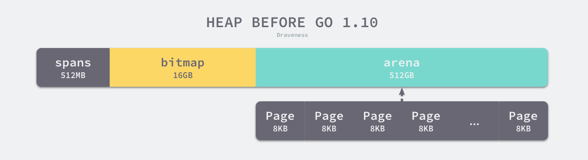
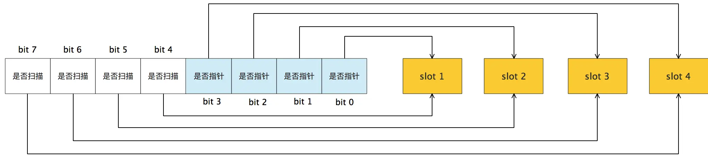

# Go的内存管理：

当Go的应用程序启动时，程序会向操作系统申请内存并初始化为虚拟内存空间。
内存空间目前分为线性空间(Go 1.10以前)和稀疏空间(Go 1.10以后)。
我们先从较为简单的线性模型入手，熟悉Golang内存分配中的基本概念，以及在内存管理中一些通用设计理念。

## 线性内存模型

如图所示，线性的虚拟内存空间分为三个部分`spans`, `bitmap`, `arena`，由这三个部分组成的内存空间是Golang的堆。
- **`arena`**:`arena`是真正存储对象的区域，Golang的Runtime将该区域按照8KB大小进行分页，之后根据存储的对象大小不同，将内存页组成`mspan`(Golang的内存管理单元)进行组合。
- **`spans`**: `spans`存储了内存管理单元`mspan`的指针，用于索引到对应的内存
- **`bitmap`**: `bitmap`用于标识`arena`区域哪些地址保存了对象。一个byte可以标识`arena`区域内4个指针大小(8 bytes)的内存。如下图所示，一个byte会用两个bits来表示`arena`中8byte大小的内存状态

从上述的内存示意图可以看出，这三个区域的大小是固定的。
`arena`做为存储对象的实际区域，空间大小为512GB。
`spans`存储`mspan`的指针，用于索引到`arena`区域内对应的page，则该区域的大小为`512GB/8KB * 8B = 512MB`。
同理，我们可以计算出`bitmap`区域所需要的内存大小`512GB/(8B * 4) = 16GB`。

### 内存管理单元mspan
`mspan`是Golang进行内存管理的基本单位，是由1个page或者多个连续page组成的内存区域。
`mspan`根据负责管理的对象大小分为67个class，每个class内负责存储的对象大小都不一样，换言之，每当程序申请内存用于存储不同大小的对象时，Golang运行时会根据所需要的内存大小先索引到对应大小范围的`mspan`，然后进行内存分配。

再深入`mspan`具体的细节之前，有个问题很重要，即为什么需要在内存页上又增设一层`mspan`的概念呢？换言之，为什么不直接在page上直接进行内存分配呢？
