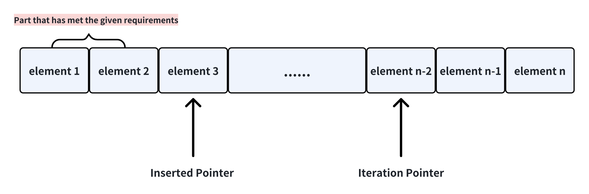

## summary
特地把这三个题放到一起看是因为这三个题很相似，解法具有共通性。此外这三个题O(n)的解法可以加深对list内遍历指针的理解。

### 26. 去除list内目标元素
这个题目的难点在于，如何原地对list进行操作才能避免移除元素引发的内存复制导致的复杂度提升，单指针肯定是没有办法的，因此我们把思路往双指针上引。
我们设定两个指针，一个是指向下一个“符合条件”的slot，另一个则是正常的遍历指针，即本轮遍历的元素对象。

对于26题，“符合条件”是不包含目标元素的list。
当遍历指针`iteration pointer`所指元素为目标元素，该元素应该直接跳过，直接到下轮下个元素，`inserted pointer`不变；
当遍历指针所指元素而非目标元素，则将该元素覆盖到插入指针所指的slot内，并移动插入指针。

### 27. 去除有序数组中的冗余元素 I
对于27题，不允许有任何的冗余元素，每个元素只能出现一次。此外，该题目还有个重要条件：`该数组是非递减的`。
首先按照26题的分析，插入指针以左每个元素只出现一次且非递减，因此只需要满足`inserted_pointer - 1`所指元素不等于当前元素即可。

### 80. 去除有序数组中的冗余元素 II
本题只允许一个元素最多出现两次，按照之前两个题的分析，只需要满足`inserted_pointer - 2`所指元素不等于当前元素即可