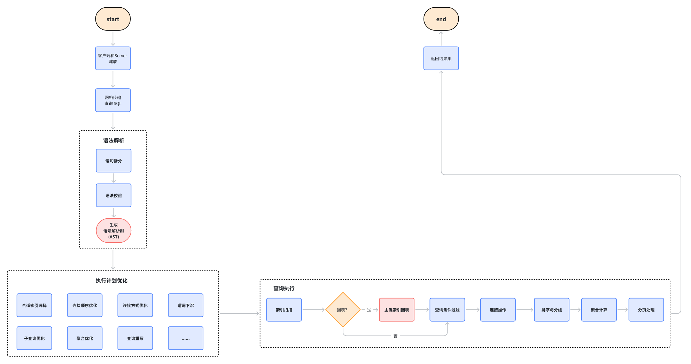
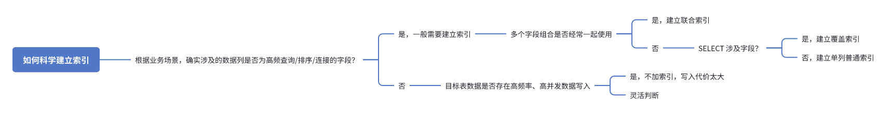

# mysql重要知识点

## 数据库基础
### 数据库三范式
### ✅ 第一范式（1NF）：字段原子性

**定义：**  
数据库中的每一列必须具备原子性，即每个字段都应只包含**单一、不可再分的值**。

**解释：**  
如果某个字段存储的是一个大 JSON，当业务需要对其中某个 key 进行插入、修改或删除时，应用层必须解析整个结构、再整体重写，维护成本高且易出错。这说明 JSON 内部的内容其实应该进一步拆解为独立字段，以便于数据操作和管理。

**实践建议：**  
在数据库列设计中，**除非该字段仅用于存储和读取且无需更新**，否则应尽量避免使用非原子结构（如 JSON、数组等）作为字段值。

---

### ✅ 第二范式（2NF）：消除部分依赖

**定义：**  
在满足第一范式的基础上，**每个非主键字段必须完全依赖于主键的全部组成部分**，不能只依赖主键的一部分。

**解释：**  
当主键是由多个字段组成的联合主键时（如 `订单ID + SKU ID`），非主键字段应与整个联合主键有关联。  
比如一个记录订单明细中商品价格的表，主键是（订单ID, SKU ID），字段包括下单价。但若将 SKU 描述等信息也放入此表，因为该信息只依赖 SKU ID，与订单ID无关，就会造成大量冗余，违反第二范式。

**实践建议：**  
此类字段应拆分至单独的 SKU 信息表中，避免冗余和更新异常。

---

### ✅ 第三范式（3NF）：消除传递依赖

**定义：**  
在满足第二范式的基础上，**所有非主键字段必须直接依赖于主键，不能依赖其他非主键字段（即不应存在传递依赖）**。

**解释：**  
第三范式要求表中每一个字段都应直接与主键关联，**而不能依赖于另一个非主键字段**。例如，在一个员工表中如果包含部门名称字段，而部门名称是由部门ID决定的，那么它就应该被拆分到一个单独的部门表中。

**总结说明：**  
第二范式强调“**完全依赖于主键**”，而第三范式进一步强调“**只依赖主键，不能依赖其他字段**”。这两者的本质都在于减少数据冗余，提高数据一致性，避免大宽表结构中嵌套冗余字段。

### 📌 总结对比

| 范式    | 目标                     | 关键约束                                  | 解决的问题         |
|---------|--------------------------|-------------------------------------------|--------------------|
| 1NF     | 字段原子性               | 每列只包含单一不可再分的值                | 嵌套字段结构       |
| 2NF     | 消除部分依赖             | 非主键字段必须完全依赖主键（整个主键）    | 联合主键冗余问题   |
| 3NF     | 消除传递依赖             | 非主键字段不能依赖于其他非主键字段        | 字段间依赖冗余     |

### MySQL 执行 SQL 语句的过程

1. **客户端与 MySQL 服务器建立 TCP 连接**
   - 客户端（例如，MySQL Workbench、PHP、Python 等）通过 TCP 协议与 MySQL 服务器建立连接。连接过程包括身份验证、权限检查等，确保客户端有权限执行相应的 SQL 查询。

2. **SQL 查询请求传输到 MySQL 服务器并进行解析**
   - 客户端发送的 SQL 查询请求通过网络传输到 MySQL 服务器。接收到请求后，MySQL 进行以下两步操作来解析 SQL 语句：

   2.1 **语法拆分**：将 SQL 语句分解成多个token，例如关键字（如 `SELECT`、`FROM`），表名、列名、运算符、常量等。这是为了将查询语句转化为更易处理的结构。

     **示例 SQL 查询：**
     ```sql
     SELECT name, age FROM employees WHERE age > 30 AND department = 'HR';
     ```

     词法单元（tokens）包括以下几个主要类别：
      1. **关键词(Keywords)**: 比如`SELECT`, `FROM`, `WHERE` 这些是 SQL 的保留字，用于表明语句的结构和意图。它们在 SQL 中有固定语义。
      2. **标识符(Identifier)**：标识数据库对象的名称，如表名、列名，用于定位数据。`name`, `age`, `employees` 需要操作的表名和列名用于数据的寻址。
      3. **运算符(Operators)**：用于进行逻辑判断、比较或连接操作。`>`, `=`, `AND` 都是典型的运算符，决定最后的结果集。
      4. **常量(Literals)**：查询条件中的`30`, `HR`都是常量值，常量通常作为过滤条件的值出现，配合运算符使用。
   

   2.2 **语法分析**：
   - **语法检查**：MySQL 会根据 SQL 的语法规则对语句进行检查。如果发现语法错误，MySQL 会返回错误并停止执行查询。
   - **解析树生成**：如果 SQL 语句合法，MySQL 会将其解析为一个 **解析树**（Parse Tree），这个树形结构表示 SQL 查询的语法结构，例如字段、表、运算符、子查询等各部分。

     **解析树示例：**

     对于给定的 SQL 查询，解析树的结构大致如下：

     ```
     SELECT
      ├── name
      ├── age
     FROM
      └── employees
     WHERE
      ├── AND
      │    ├── >
      │    │    ├── age
      │    │    └── 30
      │    └── =
      │         ├── department
      │         └── 'HR'
     ```

     **解析树的解释：**
      1. **SELECT 节点**：这是树的根节点，表示 SQL 查询的目标是 **选择**（SELECT）数据。
      2. **name 和 age**：它们是从 **employees** 表中选择的列，位于 SELECT 节点下，作为 SELECT 语句的子节点。
      3. **FROM 节点**：表示数据来源的表名，这里是 `employees`。
      4. **WHERE 节点**：表示查询的过滤条件，包含了两个子条件：
         - **AND 节点**：表示两个条件的逻辑与（AND）连接。
            - 第一个子条件是 **> 节点**，表示查询年龄大于 30 的员工。这个条件包含了 `age` 列和常量 30。
            - 第二个子条件是 **= 节点**，表示查询部门是 `HR` 的员工。这个条件包含了 `department` 列和字符串常量 `'HR'`。

3. **查询优化器生成最优执行计划**
   - 解析树生成后，MySQL 会将其交给 **查询优化器**，查询优化器会在**不改变语义**的情况下会对解析树进行优化，尽可能减少I/O, 计算和资源的使用，生成最优的执行计划。优化执行计划会考虑以下方面：
      - **索引选择**：优化器基于目标表已有的索引，并根据 WHERE, ORDER BY, GROUP BY 等谓词后的标识符，进行索引的选择，尽可能选择区分度最高的索引提高查询效率。
      - **谓词下沉**：将 WHERE 条件尽可能提到最靠近数据源的位置，减少数据集的中间体积。
     ```sql
     SELECT e.name, d.name
     FROM employees e
     JOIN departments d ON e.dept_id = d.id
     WHERE d.location = 'Beijing';
     ```
     在正常情况下，这条 SQL 的执行计划是先对 employees 和 departments 进行连接（JOIN），然后再对连接结果应用 WHERE 条件进行过滤，即筛选出 location = 'Beijing' 的记录。  
     然而，优化器如果能够将 WHERE 中的谓词提前上推至 JOIN 之前——也就是说，只对满足 location = 'Beijing' 的 departments 记录参与连接——那么就能显著减少连接操作中对内表（departments）的访问量，从而提升执行效率。
     ```sql
     SELECT e.name, d.name
     FROM employees e
     JOIN (
     SELECT * FROM departments WHERE location = 'Beijing'
     ) d ON e.dept_id = d.id;
     ```
      - **连接顺序**：如果查询涉及多个表的连接，优化器会选择最优的连接顺序，尽可能地减少中间产物的体积。
      - **连接方式**：基于数据分布、索引情况和成本估算，底层的JOIN在`NESTED LOOP JOIN`, `BLOCKED NESTED LOOP`, `HASH JOIN`中选择最优的。
      - **子查询优化**：子查询通常分为 **相关子查询** 和 **非相关子查询**。  
     **非相关查询**：子查询独立于外层查询，可被先行执行，其本质是两个 SQL 语句的串行执行结果拼接。优化主要集中在索引的选择与子查询结果集的处理效率上   
     **相关查询**：子查询依赖外层查询的某些字段，外层每处理一行，内层子查询需重新执行一次，执行过程类似于伪代码：
     ```go
     for i := range rows {
        subquery(rows[i])
     }
     ```
     具体的case可以参照：
     ```sql
     SELECT name
     FROM users u
     WHERE EXISTS ( SELECT 1 FROM orders o WHERE o.user_id = u.id );
     ```
     EXISTS 是 SQL 语法层面的关键词，用于表达一种布尔型存在判断，即子查询是否返回至少一行结果，用于构造 WHERE 或 CASE 中的“if 条件”语义。
   
     然而，实际执行过程中如何优化子查询将成为提升相关查询的关键，当外表关注的数据量很大时，低性能的子查询将会成为性能瓶颈。其实问题本质是如何优化 for 循环内的子查询。
   
     优化器通常会将 EXISTS 重写为 Semi Join，无需访问所有数据，或者说无需执行完子查询，结合 索引访问 + 提前返回（短路判断） 的执行策略，大幅提升相关子查询的性能。特别在外层数据量较大时，Semi Join 能显著减少子查询的数据访问量和执行耗时，避免性能劣化。
      - **聚合优化**：聚合优化是指优化器在执行聚合计算时采取的各种策略，以提高聚合查询的性能、减少内存或磁盘使用、加速结果返回。
      - **查询重写**：有时优化器会对 SQL 语句进行重写，转换为更高效的形式，如将 `IN` 子句转换为 `OR`，或将相关子查询改写为连接查询等。

4. **执行引擎执行查询**
   - 生成执行计划后，MySQL 的 **执行引擎** 会根据查询的执行计划开始执行 SQL 查询。执行引擎会负责对查询中涉及的表进行 **读取、过滤、排序、计算** 等操作，具体流程包括：

      - **数据访问**：根据查询条件，执行引擎会决定如何从表中获取数据。数据访问的方式包括：
        - **全表扫描**（Full Table Scan）：逐行读取整张表的数据。
        - **索引扫描**（Index Scan）：通过索引快速定位满足条件的记录；若所需列不在索引中，可能还需通过主键进行 **回表** 操作。
      - **过滤操作**：在执行查询时，MySQL 会根据 `WHERE` 子句过滤数据，排除不符合条件的记录。
      - **连接操作**：如果查询涉及多个表，MySQL 会根据执行计划中的连接顺序和连接类型（如 Nested Loop Join、Hash Join 等）执行连接操作。
      - **排序与分组**：
        - `ORDER BY` 会触发排序操作（若无可用索引可能使用 **filesort**，即排序操作发生在内存中或者依赖磁盘）。
        - `GROUP BY` 会进行分组聚合，可能使用 Hash 聚合或流式聚合等方式：
          - **sort聚合**：最常见的聚合方式。当聚合键（Group Key）无法使用索引，或结果集本身不是按聚合键排序时，执行引擎会先对数据进行排序（可能借助内存或磁盘临时表），然后基于排序结果执行**顺序扫描 + 流式聚合**
          - **流式聚合**：当聚合键可以利用索引，或查询结果天然按聚合键有序时，MySQL 可以在扫描过程中边读边聚合边输出，无需排序和临时表，性能最优。
          - **Hash聚合**：执行引擎在处理过程中为每个聚合键构建 Hash 表，将同组数据映射到哈希桶中，并进行快速聚合。适用于高基数分组，需占用较多内存。
      - **聚合计算**：执行引擎会处理聚合操作（如 `SUM`、`COUNT`、`AVG` 等），并计算出最终结果。
      - **分页处理**：通过 `LIMIT` 和 `OFFSET` 控制返回记录数。MySQL 会先读取 `OFFSET + LIMIT` 条数据，再在内存中丢弃前 `OFFSET` 条，仅返回所需结果。
      - **数据返回**：查询完成后，执行引擎会将结果集返回给客户端。

5. **存储引擎处理数据操作**
   - 存储引擎是 MySQL 中执行数据存取的底层组件，负责将数据从磁盘加载到内存，或将内存中的数据持久化到磁盘。根据查询类型（如 `SELECT`、`INSERT`、`UPDATE`、`DELETE`），存储引擎会执行相应的数据操作：
      - **数据读取**：如果是查询操作，存储引擎会根据执行计划中的访问路径（索引扫描、全表扫描等）查找数据。
      - **数据修改**：如果是修改操作（如 `UPDATE` 或 `DELETE`），存储引擎会根据执行计划进行数据修改，并可能涉及锁操作，以保证数据一致性。
      - **事务处理**：存储引擎会管理事务的提交与回滚，保证数据的一致性和隔离性，尤其是对于支持事务的存储引擎（如 InnoDB）。

6. **查询结果返回客户端**
   - 一旦查询执行完成，MySQL 会将查询结果通过连接返回给客户端。客户端收到结果后，可能进行后续的数据处理或展示。

   - 在一些情况下，如果启用了 **查询缓存**，MySQL 会检查缓存中是否有对应的查询结果。如果查询结果已经缓存且没有变化，MySQL 会直接返回缓存结果，而不需要重新执行查询。查询缓存的使用可以显著提高对相同查询的响应速度。

---

### **总结：MySQL 执行 SQL 语句的主要步骤**



1. **客户端发送 SQL 请求**：客户端通过 TCP 连接发送 SQL 查询请求到 MySQL 服务器。
2. **解析 SQL 语句**：MySQL 解析查询，检查语法是否合法，并生成解析树。
3. **查询优化**：查询优化器根据执行计划选择最优的查询执行策略，可能包括选择索引、重写查询等。
4. **执行查询**：执行引擎按照优化后的执行计划执行 SQL 查询，处理数据。
5. **存储引擎数据操作**：存储引擎负责从磁盘读取或写入数据，并保证数据一致性。
6. **查询结果返回**：查询执行完成后，MySQL 将结果返回给客户端。

通过这一系列过程，MySQL 能够高效地处理查询请求并返回结果。查询优化器在其中扮演了至关重要的角色，确保查询的执行方式是最优的，从而提高查询效率和性能。

### MySQL建表的约束条件有哪些？
1. 主键约束：自增主键或者联合主键指向数据库内一条唯一的记录
2. 唯一约束：除了主键之外，根据应用的概念，多个字段组合成唯一索引，在表内指向唯一的记录
3. 检查约束：对该列数据的范围、格式的限制，比如类型的字节长度
4. 默认约束：该数据的默认值
5. 外键约束：主表某个字段作为其他表的主键

## 索引
### 经典问题，为什么索引选择用B+树，而不是B树，BST树，AVL树，红黑树？
1. 为什么不是平衡树？
   1. 首先平衡树是二叉的，随着数据记录的增多，二叉平衡树的高度相比于b树或者b+树这类多分叉树膨胀的会很快，导致内存加载索引文件的I/O消耗会比较大
   2. 平衡树具有严格意义的平衡维护规则，可能插入或者删除一个节点，就需要对树的结构进行调整(这点我不觉得是主要原因)
2. 为什么不是二叉搜索树？
   1. 第一个原因是因为二叉结构导致的树高度膨胀，带来的I/O消耗
   2. 第二个原因则是二叉搜索树在某些情况下，会退化成链表，只是查询索引的复杂度会退化到O(N)
3. 为什么不是B树？而是B+树？
   1. 首先二者的区别对选择很重要，B树是每个节点会存储索引值+数据记录(非聚簇索引则会存储主键)，而B+树则是非叶子节点只存储索引值，叶子节点存储索引+数据记录，叶子节点之间通过数据页+链表的形式维护有序性
   2. 如果是索引某个或者某几个记录，那执行效率是一样的都是对数级别的遍历；但是如果是范围查找比如a>1这种，b树就支持的很差，需要递归遍历所有符合条件的子树；而b+树只需要查找到边界，然后遍历叶子节点的内存页即可，顺序I/O
   3. B树每个节点都包含主键或者数据记录，因此，对于存储相同内容的B树以及B+树的某个节点时，B树所占空间大小是大于一个B+树的，那么按照操作系统一次读取固定大小的内存页，对于B+树，一次磁盘读取的索引节点个数更多，相对来说总的I/O次数更小

### 名词概念：
#### 主键索引和非主键索引：
主键索引：B+树的叶子节点存的是整行数据，在InnoDB内，也被称为聚簇索引  
非主键索引：B+树的叶子节点内存的是主键，在InnoDB内，也被称为二级索引或者非聚簇索引；
#### 回表和覆盖索引：
通过二级索引映射到指定的主键，再用主键索引回表拉去数据记录的过程被称为回表  
eg. `SELECT * FROM table WHERE k = 5` 先索引到k=5的主键集合，然后在用主键查询对应的数据

覆盖索引：当`select a, b from table where k > 3 and k< 5`，假设a和b是table的联合主键，那么通过索引k可直接拉去到主键信息，无需回表，回表意味着根据指定的主键进行随机I/O，效率随着数据量的增大相对较差

#### 前缀索引
在对字符串创建索引, 如INDEX(name)中, 若字符串非常大, 那么响应的空间使用和维护开销也非常大, 就可以使用字符串从左开始的部分字符创建索引, 减少空间和维护的成本, 但是也会降低索引的选择性

索引的选择性指的是: 不重复的索引值和数据表的记录总数(T)的比值, 范围为1/T ~ 1之间, 索引选择性越高则查询效率越高. 对于BLOB, TEXT, VARCHAR等类型的列, 必须使用前缀索引, MySQL不允许索引这些列的完整长度.

先计算完整列的选择性`SELECT COUNT(DISTINCT name)/COUNT(1) FROM t`
在计算不同前缀长度N的选择性`SELECT COUNT(DISCTINCT LEFT(name, N)) / COUNT(1) FROM t`
看哪个N更靠近1, 进行索引的创建

#### 索引何时失效？
MySQL 中索引失效通常归结为两个核心原因：  
1. 索引键与查询值处于不同的比较空间，即查询语句中针对索引列的“某些操作”破坏了索引原有的有序性，得无法使用 B+ 树的跳跃查找能力，从而索引失效。
2. 使用索引的性能劣于全表扫描，即使索引理论上可用，但选择性差或需要大量回表导致成本过高，优化器会选择全表扫描以提升整体查询效率。

举例：
1. 使用 !=、 <>、 NOT 这类**不等于**或者**否定**的查询条件。
- 本质上，B+树的数据结构通过二叉等值匹配(`=`) + 范围查询(`<`, '>')支持MySQL索引的高效查询。不等于以及否定运算会破坏范围查找或者等值查找的连续性，不能使用跳跃定位，只能全索引扫描或者全表扫描。
2. 函数运算、表达式计算导致的索引失效, 函数用在索引列时, 不走索引,如 `SELECT * FROM t WHERE DATE(create_time) = 'yyyy-MM-dd'`
- 索引是基于列的原始值构建的有序结构，如 `DATE()`、`k - 1`这类的运算是不可逆的且非单调的，无法借助有序的索引快速匹配，需遍历所有索引节点进行函数计算 ➜ 失去索引跳转能力。
3. OR引起的索引失效 如 `SELECT * FROM t WHERE k = 1 OR j = 2`, 若k,j至少有一个没有索引, 则不走索引； 如果OR连接的时同一个字段, 则不会失效
- OR 前后两个查询列若均有索引，查询优化会触发索引合并，用于组合多个单列索引的扫描结果，最后再回表；但若其中一列无索引，则代表这个子句的查询是要全表扫描的，索引合并这一步就显得多余，不如直接全表扫描
4. 模糊查询导致的索引失效 如 `SELECT * FROM t WHERE name = '%三'`, %放字符串字段前匹配不走索引


#### 如何科学地决定建立哪些索引？
核心原则：索引是为查询服务的，不是为表服务的。你应该从查询出发，反推需要什么样的索引来高效支持它。一般从**查询频率**、**查询性能**以及**读写成本**三个角度来衡量。


🎯 **最终建议**：
> 按照实际查询场景，建立覆盖常用查询路径的索引结构，控制索引数量，定期用 `EXPLAIN` 和 `SHOW INDEX` 分析命中情况，结合慢查询日志持续优化。

## 📘 MySQL EXPLAIN 字段详解

`EXPLAIN` 可以用于 `SELECT`、`DELETE`、`INSERT`、`REPLACE`、`UPDATE` 等语句，用于查看 SQL 的执行计划。以下是 EXPLAIN 输出中常见字段的含义说明：

---

| 字段         | 说明                                                                 |
|--------------|----------------------------------------------------------------------|
| `id`         | 查询中每个子查询或联合查询的标识符，越大优先级越高                   |
| `select_type`| 查询的类型（如 SIMPLE、PRIMARY、SUBQUERY、DERIVED）                   |
| `table`      | 当前操作的表名或临时表名                                             |
| `partitions` | 当前访问使用的分区（如果使用了分区表）                               |
| `type`       | 访问类型，表示表的连接方式（性能由好到差：const > ref > range > index > ALL）|
| `possible_keys`| 执行计划中可用于本次查询的所有索引（可能命中）                    |
| `key`        | 实际使用的索引名称（真正被选择的）                                   |
| `key_len`    | 实际使用索引的字节长度（越长说明索引使用越充分）                     |
| `ref`        | 哪个列或常量被用来和 key 做等值匹配（如 const、func、列名）         |
| `rows`       | 估算扫描的行数（基于统计信息）                                       |
| `filtered`   | 过滤后满足条件的行占比（百分比）                                     |
| `Extra`      | 额外信息，如是否使用文件排序、临时表、是否回表等                     |

---

### 🔍 select_type 类型说明

| 类型          | 含义                                             |
|---------------|--------------------------------------------------|
| SIMPLE        | 简单 SELECT，没有子查询或 UNION                  |
| PRIMARY       | 最外层查询                                       |
| SUBQUERY      | SELECT 出现在 WHERE 中                          |
| DERIVED       | 派生表（即 FROM 子查询）                         |
| UNION         | UNION 中的第二个或后续 SELECT                    |
| UNION RESULT  | UNION 查询结果集                                 |
| DEPENDENT SUBQUERY | 子查询依赖外层查询                          |

---

### 🔍 type（访问类型）说明（越靠上越好）

| 类型       | 说明                                                                 |
|------------|----------------------------------------------------------------------|
| `system`   | 表只有一行（系统表），性能最好                                        |
| `const`    | 常量比较，最多一行匹配（如主键或唯一索引 = 常量）                    |
| `eq_ref`   | 唯一索引等值连接（每次连接只返回一条记录）                           |
| `ref`      | 普通索引等值连接，可能返回多行                                       |
| `range`    | 索引范围扫描（如 `BETWEEN`、`> <`、`IN`）                             |
| `index`    | 全索引扫描（遍历整个索引，不访问数据行）                             |
| `ALL`      | 全表扫描（最差）                                                     |

---

### 🔍 Extra 字段常见值说明

| Extra 信息                   | 含义                                                            |
|-----------------------------|-----------------------------------------------------------------|
| Using index                 | 使用覆盖索引，避免回表                                          |
| Using where                 | 使用了 WHERE 过滤条件                                           |
| Using temporary             | 使用临时表（多见于 GROUP BY、DISTINCT）                         |
| Using filesort              | 没有使用索引排序，采用文件排序（可能在磁盘）                    |
| Using index condition       | 使用了 Index Condition Pushdown（ICP），进一步利用索引过滤       |
| Using join buffer (Block Nested Loop) | 使用了连接缓存（可能是由于未命中索引）             |
| Impossible WHERE            | WHERE 条件永远不可能成立                                       |
| Select tables optimized away| 典型场景如 `SELECT COUNT(*) FROM table`，可直接通过索引统计优化   |

---

## 事务
### 事务的四大特性：
1. 原子性：即事务内所有的命令是一个不可拆分的工作单位，要么全部提交，要么部分提交
2. 一致性：根据定义，一致性是指事务执行前后，数据从一个合法性状态变换到另外一个合法性状态。这种状态是语义上的而不是语法上的，跟具体的业务有关
3. 隔离性：事务之间的执行是隔离的，不能互相干扰
4. 持久性：试图一旦提交，数据库内的数据即永久改变，即使出现了故障，但也能恢复

#### 原子性的实现：
mysql具有undo log, 事务开始时，server会为事务生成一个undo log文件；每执行事务中的一条写命令，undo log都会产生一条撤销该操作的回滚sql；
当事务执行失败或者手动调用rollback，mysql利用undo log的内容进行回滚；如果事务成功提交，则该log文件会被刷入磁盘

#### 一致性的实现：
首先一致性是事务最终实现的目标，即执行事务后的数据要符合程序设计，比如优惠金额的字段不能经过算价变成负的，从数据库字段约束的角度，负值没毛病；但是字段语义上是不合理；  
因此应用层要判断修改后数据的合法性和一致性

#### 隔离性的实现：
隔离性主要是通过锁+mvcc实现不同的隔离级别

再具体描述隔离性的实现之前，我们先简单了解下mysql的锁以及mvcc的原理

##### 锁：
mysql的锁实现，大致分为最基本的两类，一个是共享锁，一个是排他锁，只有共享锁是可重入的，排他锁和二者都是互斥的

当事务内执行命令时，比如`update table set balance = 50 where user_id = 123`, 如果user_id是普通索引或者是联合索引的最左列，那么根据索引树，事务会获取user_id = 123所有记录的排他锁；这样其他事务因为获取不到该记录的锁，从而被阻塞直到持有锁的事务结束  
当然，如果执行语句的查询条件是没有索引或者不符合最左匹配，那么行锁会升级到表锁，将这个表锁住，任何对表的读写都会被阻塞

mvcc原理是，每个事务都只能读取到小于当前事务编号的最新数据快照，更准确的说，事务开始的时候，mvcc会维护一个数据表的快照，无论其他事务怎么修改，该事务一切读取操作都是依赖该快照的

我们知道mysql底层是如何进行同步的，那么按照隔离级别从低到高来描述事务隔离性的具体实现
1. 未提交读：
   1. 只保证多个修改事务的交集数据不会并发更新，即用排他锁锁定待更新的数据记录且**排他锁无需等待事务结束即可释放**。因此，对于事务未提交的修改，由于排他锁在数据修改完成即释放，而非事务结束后，所以其他事务可以在数据修改前后的任意时刻给这些记录添加共享锁，从而读到未提交的修改；
   2. 这种隔离级别最大的问题就是会造成数据的不一致，即可能会读取到未提交的数据修改，当修改事务的改动因某种原因回滚，那么对于读取事务就出现了读取到的数据和实际数据的不一致，最终导致事务的执行不能匹配一致性，这种现象成为脏读
2. 已提交读：
   1. 为了解决未提交读的脏读问题，mysql要求更新数据的排他锁必须在事务结束之后才能释放，保证未提交的改动不能被其他事务读取，因此当事务读取到其他事务正在修改的记录时，会因为排他锁而阻塞直到修改事务结束
   2. 换句话说，当修改被提交之后，其他事务就可以读取到变动了；意味着某个事务内同一条sql读取到的数据可能内容会不一样，即不可重复读的问题；不可重复读本质上是，事务在不同时刻读取的数据记录可能不一样，因此依赖于不同时刻读的数据，会导致不同的程序执行动作，造成不一致性
3. 可重复读：
   1. 进一步，为了使得事务不同时刻读取的数据不受到其他事务提交的影响，因此事务开始时，事务会获取当前的数据快照，事务的执行都是依赖这份快照；其他事务的已提交变动不影响该事务
   2. 那么，对于事务来说，读取到的数据保证了前后的一致，但可能是旧数据，则数据没有按照预期顺序执行最终导致不一致性，所以需要应用层自己处理，比如事务外先抢锁，抢到锁需要判断当前数据是否符合预期，然后修改
4. 可串行化：
   1. 这个不多说了，所有事务按照要求同步串行执行

此外有种问题，没有在上述的隔离实现中描述，被称为幻读，一般会出现在已提交读中

从上述锁的实现中，我们发现锁是某个事务针对某些数据执行权的排他，比如我们用行锁保证符合某个索引条件的记录不可被其他事务修改，但是此时插入某条数据时，也同时需要在索引结构内添加该记录（或者主键），mysql是没有什么限制的，那么除了某条数据发生变化的不可重复读；数据的数量也发生变化，即事务的修改好像没有执行完成

因此，在可重复读的实现中，通过数据快照的方式解决了幻读问题；那么在更低的隔离级别，比如已提交读内，怎么解决幻读问题？

比如，公司要给所有50岁以上的员工发礼物，此时后台程序操作并完成`update table set gift = coupon where age > 50`，在事务提交之前，另一个线程添加了新入职的员工a，大于50岁，那么按照行锁的方式，这个新添加员工是没有被update的

因此需要有间隙锁，`select * from table where age > 50  for update` 即事务执行过程中不能插入大于50的元素，插入操作会因为间隙锁而阻塞直到锁释放
##### 持久化的实现:
持久化主要是依托redo log记录每一个事务的执行结果，并将日志存入磁盘，只要事务提交或者redo log 的内存buffer满了，redo log就会落盘持久化，那么server宕机也可以随时恢复丢失的数据

为了保证数据的持久化，mysql一般采用WAL(write-ahead log)的写入策略，即执行数据的更新之前，先进行redo log的写入，即将更新的数据从磁盘加载到内存进行更新，事务提交，redo log写入buffer或者直接刷盘（如果对一致性的要求很高）

首先内存操作的效率以及资源损耗一定比磁盘好：

1. 将数据的变动持久化到磁盘是一个随机IO的过程，需要先找到对应数据位置，然后持久化改动，效率很低；然后redo log是一个内存中的顺序IO，效率高；
2. 事务提交之后，redo log一般情况下不会立即刷盘（除非对一致性要求很高），而是定时+文件缓冲区满时，一次刷盘，减少磁盘I/O次数，redo log因为是append顺序I/O(相邻内存块减少寻址时间，同时数据块也会预先加载减少等待)，所以性能损耗较小；而数据持久化则是随机I/O效率较低，因此尽量减少次数

## 主从架构
主节点一般是用redo log进行持久化数据的恢复，而从节点则是用binlog进行数据的同步和重放

binlog的内容一般分为两种:
1. statement，记录的为sql语句，即描述一个sql语句造成的影响
2. row，记录的是每一行的改动，修改前和修改后的变动

binlog在主从架构下，除了保证从节点的写入和数据复制，还用来配合redo log判断主节点数据是否需要回滚  

redo log和undo log都是随着事务执行不断往buffer内写入，而binlog只在**事务提交时写入磁盘**，那么事务提交成功，但是binlog没有写入，则从库相比于主库会少了本次操作。

因此，InnoDB采用两阶段的事务提交方式，拆分为prepare和commit：
1. 执行事务过程中，写入redo log和undo log，此时redo log处于prepare状态
2. 修改内存数据，完成事务内所有操作，事务已经是可提交状态，此时将binlog写入磁盘
3. 然后提交事务，redo log 改为commit 状态，和undo log写入buffer或者直接落盘

那么当server宕机时，这三个log可分为redo log和binlog，有以下几种情况:
1. 当redo log文件包含该事务时，binlog一定也写入了，因为binlog写入是在事务提交+redo log落盘之前写入的，此时该事务需要恢复数据；即redo log落盘一定表明该事务执行完成  
2. 当redo log无事务信息或者事务信息不全(并非同步刷盘)，但是binlog有，则表明数据已经写入但是提交时有问题，那么该数据mysql认为操作是合理的，则根据binlog进行逻辑恢复，同时补全redo log
3. 当redo log无事务信息或者事务不全，但是无对应事务的binlog，则需要回滚这部分redo log

